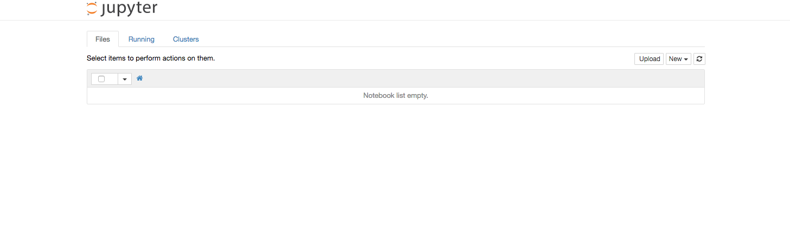

Installing a robust environment can be tricky and painful. A data science without his environment is just like a musician without his instrument. We tried several softwares, programming language etc. We found **jupyter notebook** with proper kernels (python2, python3, pyspark) to be one of the best answer for our needs. 

In this tutorial we will show how to properly your jupyter environment with both a python2 and a python3 version. 

### Step 1 : Install python2 and python3

##### Why do I need python2 and python3

Python2.7 is a very stable version that has been used in a lot of programs, there is a high probability of finding 2.7 codes, if you want to run or edit ".py" files that have been coded in this version you will need to have this version of python ready.

Python3.5 is the latest stable version and support all the new packages, if you need to use the latest library that has been developed only for 3.5 you will need to have this version ready. Eventually (but this can take time) most of the code will migrate towards python3.5.

##### Install

Installing python is quite straight forward, we highly recommend to use **brew** to install the various librairies. If you do not have Homebrew you can easily get it via the terminal command : 

```shell
ruby -e "$(curl -fsSkL raw.github.com/mxcl/homebrew/go)"
```

You can then easily install both version of python via :

```shell
brew install python2
brew install python3
```

### Step2 : Install Jupyter Notebook 

Jupyter notebook is a great development tool, that allows to easily play within a python code, run portion of it etc. A classical development would imply the creation of jupyter notebook, making sure everything works properly and then **and only then** create the final ".py" that can then be run directly in command line. 

In the previous section did not only installed python it also installed 'pip' which is the most popular python package manager. In order to get install jupyter you simply need to run :

```shell
pip install jupyter
```


###  Step3 : Configure the python kernel

Jupyter notebook works with kernel, it can be quite a mess to properly configure them. The working environment I use on a daily basis contains three kernels : py2, py3, pySpark, these kernels covers the two versions of python and a stable version of spark (we will discuss in another article how to properly setup it). The main advantages of such an environment is that you can have a repo or a folder with all your notebooks that can be in version 2 in version 3 etc. The idea is that upon creation of your notebook you will define the kernel it linked to (this kernel can then easily be changed); when you come back on the notebook it will automatically be open with the proper kernel. 

##### Setup

Setting up the kernel can be quite messy, here is how you should do it in order to have a proper installation. 

```shell
python -m pip install virtualenv --user

# configure python2 kernel
python -m virtualenv -p python2 ~/py2_kernel
source ~/py2_kernel/bin/activate
python -m pip install ipykernel
ipython kernel install --name py2 --user
deactivate

# configure python3 kernel
python -m virtualenv -p python3 ~/py3_kernel
source ~/py3_kernel/bin/activate
python -m pip install ipykernel
ipython kernel install --name py3 --user
deactivate
```

You then need to add the aliases to the kernel in your shell config file (bash_profile, bashrc, zshrc).

```shell
echo "alias kernel2='source ~/py2_kernel/bin/activate'" >> ~/.bash_profile
echo "alias kernel3='source ~/py3_kernel/bin/activate'" >> ~/.bash_profile
```

### Step4 : Usage 

##### Run a notebook

In order to launch jupyter you simply need to do :

```shell
jupyter notebook
```

You should have a window like this: 



##### Install a library

Let's say you want to install the library pandas on your python2 kernel you will need to do : 

```shell
kernel2
pip install pandas
```

Obviously if you want to install a library on the python3 kernel you will need to do :

```shell
kernel3
pip install pandas
```


