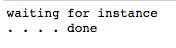
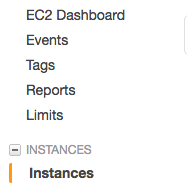

### Introduction and Workflow

As data scientist you are quickly exposed to machine learning algorithm and to programming language (python or R usually) and most of tutorial / classes stop there. However being able to run cloud computation using an EC2 can be a very important skills in real life. Starting an EC2 is trivial, you simply have to go on AWS select your machine and there you go but this is far from what you want. What you want as a professional data scientist is a proper machine in the cloud with a proper environment ready to receive your python code and to launch it, without the strugle to run everything line by line. A few months ago I found myself desperate to find a tutorial in order to automate the creation and the configuration of a virtual machine on AWS as well as being able to transfer files, launch scripts and recolt the results. 

After a lot of research I was finally able to produce a jupyter notebook that can **pilot** your activity. At the end of this tutorial (in 2 posts) you will have the tools to have a workflow such has :

**Article 1:**

1. [jupyter notebook] Launch an EC2

**Article 2:**

1. [jupyter notebook] Transfer the proper files and scripts including the install.sh 
2. [ssh] Install all the necessary softwares and libraries
3. [ssh] Run your python script - that will save the results in your S3
4. [jupyter notebook] Close the EC


#### CAREFUL

EC2 is no joke, it is linked to your credit card and you should be very very very cautious with your credentials (AWS secret key and ID). You will see later in this tutorial that you need to setup a file "root key.csv" where lies these informations, **do not share them**. When I was experiencing with this technology I pushed by mistakes on my git this file, 1 min later I had 80 big servers running on amazon for a total cost of 180$/hours, fortunately I was able to quickly call amazon and settle this issue, but be really careful with this. 

### Requirements

Here is the git folder with the files : 

[Link To Git Folder](https://github.com/argmin404/argmin404.github.io/tree/master/Jupyter%20Notebook%20and%20Files/LaunchEC2)

In order to follow this tutorial you will need :

- Jupyter Notebook with a python2 kernel and a python3 kernel
- An AWS account
- In a folder the following files:
  - root key.csv : a file containing your aws credentials (cf next section on how to create it)
  - LaunchEC2.ipynb : the jupyter notebook that pilot the activity


### Root Key.csv

1. Go to your AWS [AWS Home](https://www.amazon.com/ap/signin?openid.assoc_handle=aws&openid.return_to=https%3A%2F%2Fsignin.aws.amazon.com%2Foauth%3Fresponse_type%3Dcode%26client_id%3Darn%253Aaws%253Aiam%253A%253A015428540659%253Auser%252Fhomepage%26redirect_uri%3Dhttps%253A%252F%252Fconsole.aws.amazon.com%252Fconsole%252Fhome%253Fnc2%253Dh_m_mc%2526state%253DhashArgs%252523%2526isauthcode%253Dtrue%26noAuthCookie%3Dtrue&openid.mode=checkid_setup&openid.ns=http%3A%2F%2Fspecs.openid.net%2Fauth%2F2.0&openid.identity=http%3A%2F%2Fspecs.openid.net%2Fauth%2F2.0%2Fidentifier_select&openid.claimed_id=http%3A%2F%2Fspecs.openid.net%2Fauth%2F2.0%2Fidentifier_select&action=&disableCorpSignUp=&clientContext=&marketPlaceId=&poolName=&authCookies=&pageId=aws.ssop&siteState=registered%2Cfr_FR&accountStatusPolicy=P1&sso=&openid.pape.preferred_auth_policies=MultifactorPhysical&openid.pape.max_auth_age=120&openid.ns.pape=http%3A%2F%2Fspecs.openid.net%2Fextensions%2Fpape%2F1.0&server=%2Fap%2Fsignin%3Fie%3DUTF8&accountPoolAlias=&forceMobileApp=0&language=fr_FR&forceMobileLayout=0)

2. Go to security credentials

   

3. Click on Continue with security 

4. Click on Create New Access Key

   

### The Jupyter Notebook

As explained above the jupyter notebook leads to the creation of the VM and to sending the proper files on it. In our case it will send 

- install.sh : a bash file that performs all the installation
- main.py : the main script that in this case reads from the S3 and save into it


Let's look deeper into the code : 

#### Library Loading

```python
import boto
from boto.manage.cmdshell import sshclient_from_instance
import time
import pandas as pd
import os
```

**Boto** is the key library here, it is the one that makes the connection between your EC2 and your notebook. You don't have to understand more than that.

#### Connection to EC2

```python
ec2 = boto.connect_ec2(aws_access_key_id=access.loc[0,1], 
                       aws_secret_access_key=access.loc[1,1])
```

In these two lines you make the bridge to the EC2 by giving your aws access key id and your aws secret access key.

#### Access your current instances 

```python
reservations = ec2.get_all_instances()
instance = reservations[0].instances[0]
```

These lines simply get all your running instances, if **you don't have any instance running** this will cause **an error** (which is normal):


 You will need these lines in a very specific situation : you closed your python kernel, then re-opened it again and you want to close your EC2 from your notebook. 

#### SSH Mapping

In order to be able to access your amazon machine and push file you need to create a proper ssh key and link it to your AWS, the next few lines do it for you. Please note that these lines must be done only **once** , once it has run you won't ever have again to run them : 

```python
key_pair = ec2.create_key_pair('aws-key')
key_pair.save('~/.ssh')
group = ec2.create_security_group('root', 'A group that allows SSH access')
group.authorize('tcp', 22, 22, '0.0.0.0/0') # to properly authorize ssh
```

**NB**: the first two lines of code only work on python2 (for some reasons), if you only have python3 you can create the key using the following lines in your shell (then follow the instruction): 

```shell
ssh-keygen -t rsa -f ~/.ssh/aws-key
```

#### Run the Instance

This is the turning point, these few lines actually run the instance. The usual approach I suggest is to first use a *t2.micro* instance to make sure everything works and then run on a bigger one. 

```python
## Running a classical Amazon t2.micro Linux Instance
reservation = ec2.run_instances(image_id='ami-60b6c60a', 
                                key_name='aws-key', 
                                instance_type = 't2.micro',
                                security_groups = ['root'])

instance = reservation.instances[0]
print('waiting for instance')
while instance.state != 'running':
    #print ('.', end = "")
    print('.'),
    time.sleep(5)
    instance.update()
print('done')
```

**To change the instance**, you simply need to change the argument *t2.micro* for something else, I strongly suggest to use the amazon machines. You can look into this table to see the list of the available instances : [Amazon Doc](https://aws.amazon.com/fr/ec2/instance-types/.).

You should see  :



#### Connect to the instance

You now have your instance running ! You're now probably eager to connect to it. In order to do so you need to :

1. Connect to your AWS : [AWS Home](https://www.amazon.com/ap/signin?openid.assoc_handle=aws&openid.return_to=https%3A%2F%2Fsignin.aws.amazon.com%2Foauth%3Fresponse_type%3Dcode%26client_id%3Darn%253Aaws%253Aiam%253A%253A015428540659%253Auser%252Fhomepage%26redirect_uri%3Dhttps%253A%252F%252Fconsole.aws.amazon.com%252Fconsole%252Fhome%253Fnc2%253Dh_m_mc%2526state%253DhashArgs%252523%2526isauthcode%253Dtrue%26noAuthCookie%3Dtrue&openid.mode=checkid_setup&openid.ns=http%3A%2F%2Fspecs.openid.net%2Fauth%2F2.0&openid.identity=http%3A%2F%2Fspecs.openid.net%2Fauth%2F2.0%2Fidentifier_select&openid.claimed_id=http%3A%2F%2Fspecs.openid.net%2Fauth%2F2.0%2Fidentifier_select&action=&disableCorpSignUp=&clientContext=&marketPlaceId=&poolName=&authCookies=&pageId=aws.ssop&siteState=registered%2Cfr_FR&accountStatusPolicy=P1&sso=&openid.pape.preferred_auth_policies=MultifactorPhysical&openid.pape.max_auth_age=120&openid.ns.pape=http%3A%2F%2Fspecs.openid.net%2Fextensions%2Fpape%2F1.0&server=%2Fap%2Fsignin%3Fie%3DUTF8&accountPoolAlias=&forceMobileApp=0&language=fr_FR&forceMobileLayout=0)

2. Click on the EC2 Icon

3. Click on "Instances" on the left 

4. You should have screen like, if you don't you might have to change the region on the top right (N.Virginia in my case), just loop through the one available until you find an instance running.

   

5. Click on **connect** at the top of the screen 

6. A window similar to this should appear :

   

7. Copy the line below **Example**, in my case : 

   ```shell
   ssh -i "ec2-romain5-key.pem" ec2-user@ec2-54-235-239-238.compute-1.amazonaws.comssh -i "ec2-romain5-key.pem" ec2-user@ec2-54-235-239-238.compute-1.amazonaws.com
   ```

8. Go on your terminal and type : 

   ```shell
   cd .ssh
   ```

9. … then paste into your terminal the line from 7: 

   ```shell
   ssh -i "ec2-romain5-key.pem" ec2-user@ec2-54-235-239-238.compute-1.amazonaws.comssh -i "ec2-romain5-key.pem" ec2-user@ec2-54-235-239-238.compute-1.amazonaws.com
   ```

10. You may get a security prompt, just type **yes** then press enter

    

11. You should get something like the image below

    

Congratulation you are now fully connected to your ec2. However this is not where it ends, next steps will consist in being able to transfer file to the server, to link it to your S3 bucket, make the proper installation and properly run a python script. 